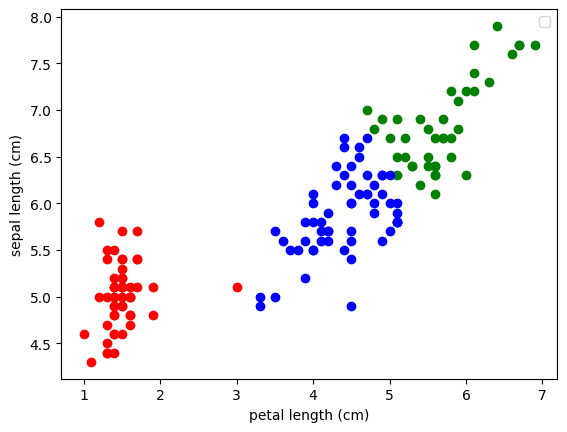
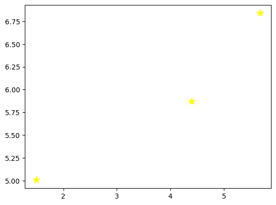

# K-Means Clustering on Iris Dataset


## Overview

This repository demonstrates the implementation of the K-Means clustering algorithm on the Iris dataset using Python. The project explores how unsupervised learning can group data into clusters based on similarities, without relying on predefined labels.

---

## Features

- **K-Means Clustering Algorithm**: Implementation of the K-Means algorithm for clustering the Iris dataset.
- **Visualization**: Includes scatter plots to visualize clusters and their centroids.
- **Dataset**: Utilizes the popular Iris dataset, containing measurements of sepal and petal dimensions of three Iris flower species.

---

## Prerequisites

Ensure you have the following installed:

- Python 3.x
- Libraries: 
  - NumPy
  - Pandas
  - Matplotlib
  - Scikit-learn

You can install the required libraries using the following command:

```bash
pip install numpy pandas matplotlib scikit-learn
```

---

## Getting Started

1. Clone the repository:

```bash
git clone https://github.com/sounakss7/K_means_IRIS_DATASET.git
cd K_means_IRIS_DATASET
```

2. Run the Python script:

```bash
python kmeans_iris.py
```

---

## Dataset

The Iris dataset contains 150 samples of three Iris species:

- Iris-setosa
- Iris-versicolor
- Iris-virginica

Each sample includes the following features:

- Sepal length
- Sepal width
- Petal length
- Petal width

---

## Visualizations
### Clusters Formed by K-Means

### Cluster Centers


---

## Code Structure

- `kmeans_iris.py`: Main script implementing K-Means clustering and visualizations.
- `README.md`: Project documentation.

---

## Results

- The algorithm successfully clusters the Iris dataset into three groups.
- Visualization of clusters shows distinct groupings based on petal and sepal dimensions.

---

## Contributing

Contributions are welcome! Feel free to open an issue or submit a pull request for enhancements or bug fixes.

---

## License

This project is licensed under the MIT License. See the `LICENSE` file for details.

---

## Acknowledgments

- **Dataset**: Iris dataset from [UCI Machine Learning Repository](https://archive.ics.uci.edu/ml/datasets/iris)
- **Inspiration**: Learning and implementing unsupervised machine learning techniques.

---

## Contact

- **Author**: Sounak
- **GitHub**: [sounakss7](https://github.com/sounakss7)
- **Email**: [hrick3130@gmail.com](hrick3130@gamil.com)
